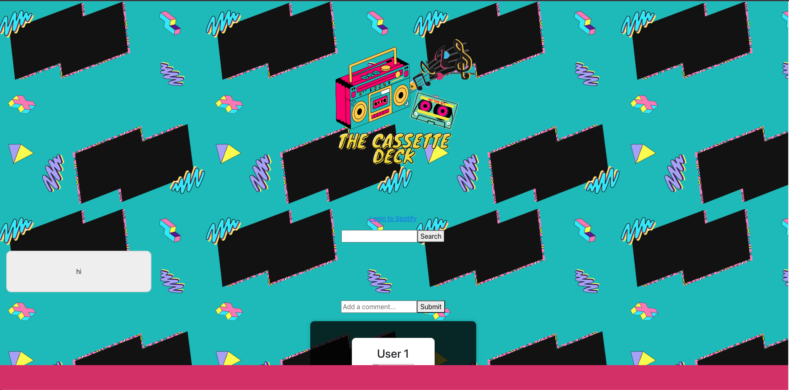

# The-Cassette-Deck

- [Description](#description)
- [Installation](#installation)
- [Usage](#usage)
- [License](#license)
- [Links](#links)
- [Credits](#credits)

## Description

User Story: 
As an... avid music listener
I want to...share my eclectic taste in music with my friends through a blog
So that...they can enjoy and rate my playlists by using the vibe meter 

## Installation

To run locally, clone the github repo link to your local computer. In the CLI, enter npm install for the necessary packeges, and npm run install bootstrap react-bootstrap in order to install the bootstrap. After, run npm install axios to install axios. Next, go to the root directory and enter npm run develop to initialize the webpage. 

## Usage

This applicatiom is intended for spotify music listeners and music listeners in general who want to share their favorite music playlists with others on the web. Users can create their own personalized profile pages to share as well as rate other user's playlists that have been posted. Users can add others to their friend's list so they can always keep track and be notified of new playlists posted. 

## License

MIT

## Links

For more information, visit our GitHub page: [TheCassetteDeck](https://github.com/orngmrmld/The-Cassette-Deck)  
Deployed Link: https://the-cassette-deck-8f7eb67739f4.herokuapp.com/

## Credits
- Kayvon Kazemini - TA - assisted 
- Coding activities from the UCB repo for class use purposes 

## Mockup Example Product 
